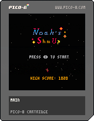

# Noah's PICO-8 Games

A collection of games I've created using PICO-8, a fantasy console for making, sharing, and playing tiny games.

## Games

### 🚀 Noah's Shm Up 01

My first game developed with PICO-8 - a classic shoot 'em up experience built within the charming constraints of the fantasy console.
